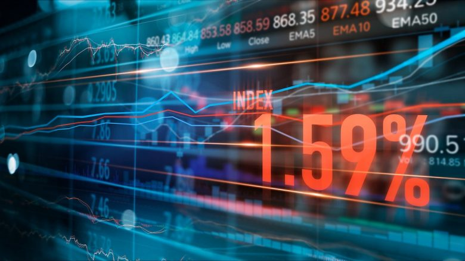
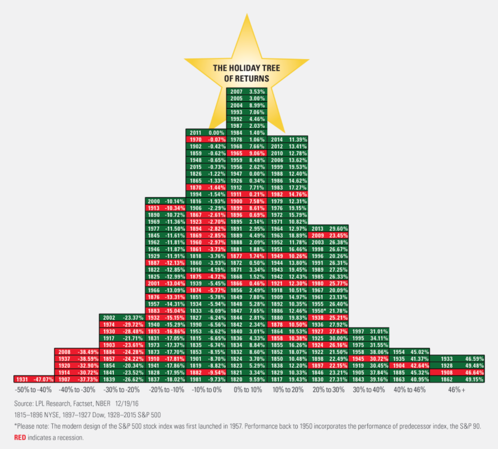

# **TraderbotAdviser**

### **Contributors : Alpa Sheladia, Brian Withrow, Lee R. Redfearn, Mischelle Massey, Nathan Bratz**
                                           

The purpose of this project is to predict future stock movement using a Logistical Regression Model which allows the User to choose a company from the S&P 500 to predict the price movement of a company's stock on the next trading move based on current sentiment (Vader) of Google news articles related to such company.

Looking for executable orders using automated pre-programmed trading instructions accounting for variables such as time, price, sentiment from news media, and volume?
You've come to the right place, we'll have your back using vix score volitality measurement to decide whether to buy, sell or hold on to your investment in various industries. In this project, we'll be comparing prices from latest quaters of following corporation to build algorethmic robo advisor that can guide you with your investment insequrities. it'll research new media and past stock pattern to come up with the best decision for your stock invesment so you don't have to spand time following market. our bot will be equip for trading attempts to leverage the speed and computational resources of computers relative to human traders. According to Walstreet jornal article, A study in 2019 showed that around 92% of trading in the Forex market was performed by trading algorithms rather than humans.

Focusing on some of the most volatile industries as below. 

 

#### **Indutries:**

Airline = American Airline (AAL)
Tech = Apple (AAPL)
Oil & Gas = Exxon (XOM)
Crypto = Bitcoin (BTC)  
Medical = pfizer (PFE)

#### NOTE: You must have active keys from the following APIs to run this program:

  IEX Finance: https://iexcloud.io/
  News API: https://newsapi.org/
  Alpha Vantage: https://www.alphavantage.co/
  Yahoo Finance: https://finance.yahoo.com/quote/API/

#### **Possible New Metrics/Tools to Use:**

●Cross Validation (Better estimation of test error)

●Stepwise Regression, LASSO Regression (removing/reducing contribution of insignificant predictor variables

●Pipeline (makes single sequence of operations to perform on data for Machine Learning)

●Use nltk and tensorflow for neural networks on natural language processing

#### **For Tree Models:**

●Random Forest, Boosting, ​Bagging* (Bootstrap Aggregation; combine averaging resultsfrom smaller tree models)

●Have results for different depth levels (longer trees tend to lead to overfitting)

#### **For Neural Networks:**

●Graph performance results using multiple layers, ​network types​ and ​learning rates

## **TraderbotAdvisor** 

 
● Which are your available assets? How much can you afford to invest?

● Which is your goal?

● Which is your investment timeline?

● Do you want to re-invest profits or do you want to withdraw profits?

● Which is your profit expectation?

● Which kind of investor are you: do you prefer big wins or small losses?

● What is the media influence?

#### **Questions to be solved by the end of the project:**

● How much the news media has contributed in the stock market volotality over past two years?

● Is this a supervised or unsupervised learning task? what are data features and what is the target variable? If unsupervised, what are the data features and what do we hope to find?

● What variables our roboAdvisor considers while advising on stock market?

● How did the Machine learning played role in it?

